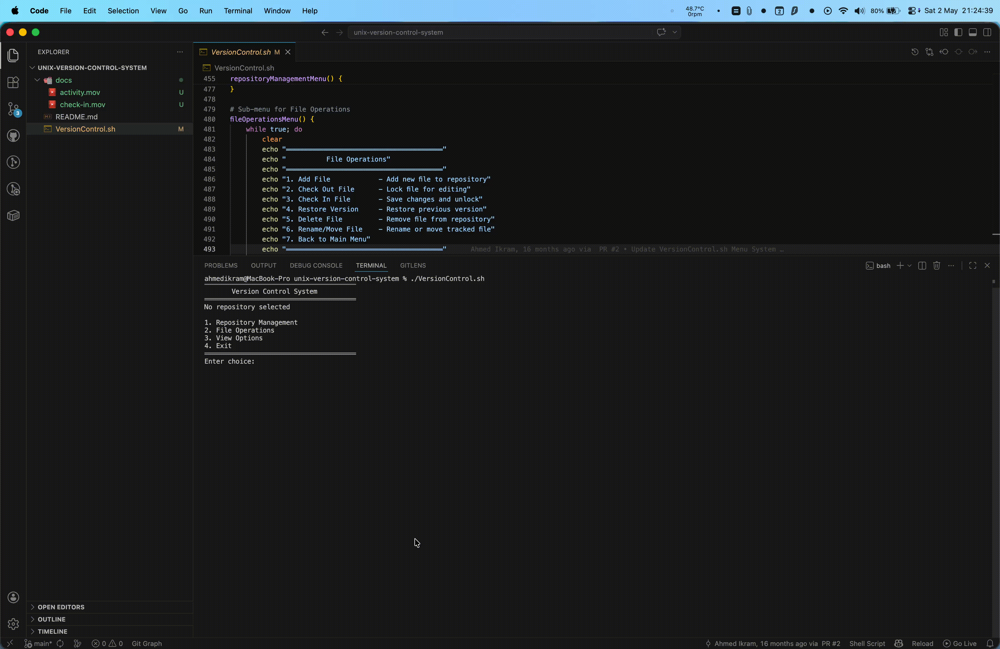
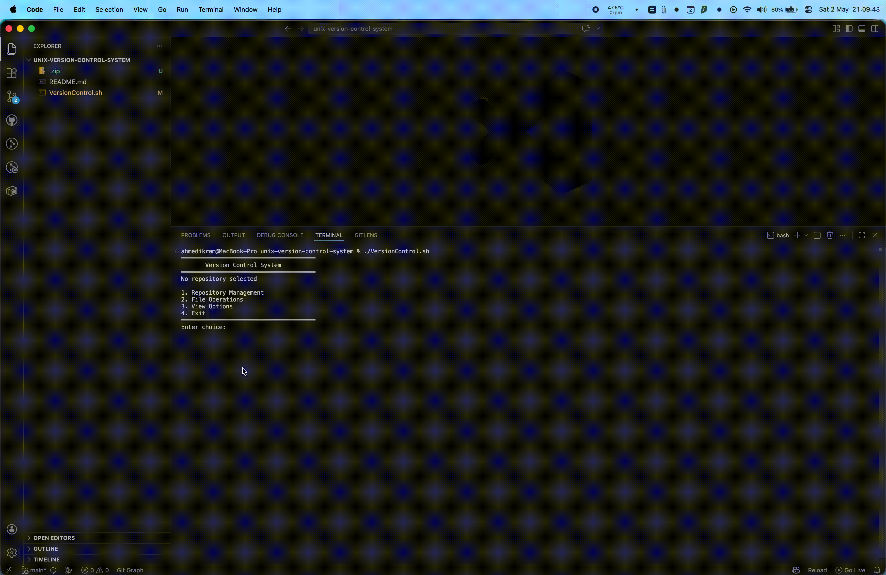
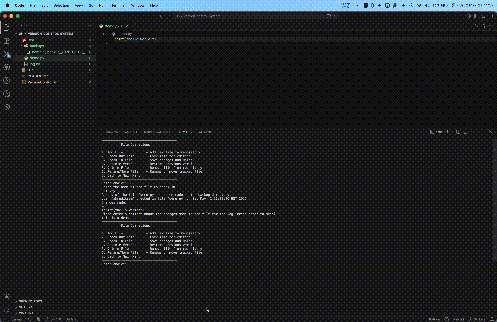

# Unix Version Control System

> A Git-like version control system built entirely in Bash - file tracking, check-in/check-out with locking, timestamped backup versioning, automatic diff generation, and filterable activity logging. Zero external dependencies beyond native Unix utilities.

<p align="center">
  
  
  
</p>

---

## Demo

### Menus - Repository Management, File Management and Options Menus



### Check-in flow - automatic diff output shown before committing, with optional comment prompt



### Activity log - filtered view showing check-ins for a specific file with inline diffs



---

## Architecture

The entire system is a single Bash script — `VersionControl.sh` — structured around a three-tier menu system and a set of focused functions, each responsible for one operation. State is maintained in two variables (`currentRepo`, `logFile`) and the filesystem itself — no database, no config files, no external state.

```
VersionControl.sh
│
├── mainMenu()                    # Top-level navigation
│   ├── repositoryManagementMenu()
│   │   ├── createRepository()    # mkdir + backup dir init
│   │   ├── selectRepository()    # validate + switch currentRepo
│   │   └── archiveRepository()   # zip -r entire repo
│   │
│   ├── fileOperationsMenu()
│   │   ├── addFile()             # touch new tracked file
│   │   ├── checkOut()            # cp + .checkedout lock + log + nano
│   │   ├── checkIn()             # diff + mv + timestamped backup + log
│   │   ├── restore()             # ls -t backups | head → cp restore
│   │   ├── deleteFile()          # cp .deleted_ backup + rm
│   │   └── renameOrMoveFile()    # mv + backup history preservation
│   │
│   └── viewOptionsMenu()
│       ├── listRepositoryContents()
│       ├── viewFile()
│       ├── statusSummary()       # locked files + latest check-in + deleted backups
│       └── viewLog()             # grep-filtered log viewer (less / cat)
```

---

## Design Decisions

**File locking via `.checkedout` sentinel files** — When a file is checked out, a `.checkedout` copy is created alongside the original. The presence of this file is the lock signal — check-in detects it, check-out refuses to re-lock an already-locked file. This mirrors the pessimistic locking model used in centralised VCS systems (SVN, CVS) without requiring any daemon or lock registry.

**Diff embedded in the log, not just shown** — At check-in time, the diff between the original and edited version is written to the activity log as well as printed to the terminal. This means the log is a full audit trail — not just timestamps, but the actual content changes at each point. `grep` filtering by filename, check-in, or check-out type makes this log queryable without any external tooling.

**Timestamped backups, not delta chains** — Each check-in creates a full copy of the file with an ISO 8601 timestamp suffix (`filename.backup_2025-03-01_14-22-10`). This trades storage efficiency for simplicity and robustness — restoring any version is a single `cp` operation, and there's no risk of a corrupted delta chain making older versions unrecoverable.

**Soft delete with backup preservation** — Deleted files are not `rm`-ed silently. A `.deleted_` timestamped backup is created first, so any deletion is recoverable via `restore()`. This is a deliberate safety net — the most common source of data loss in simple file systems is an irreversible delete.

**`restore()` targets second-most-recent backup** — When rolling back a file that still exists, `restore()` selects the second-most-recent backup (`head -n 2 | tail -n 1`) rather than the most recent. This is because the most recent backup *is* the current version — restoring it would be a no-op. The second-most-recent is the actual previous state.

**Zero external dependencies** — The only non-POSIX tool used is `nano` for editing (configurable) and `zip` for archiving. All core VCS logic — diffing, logging, file locking, backup management, log filtering — uses only `diff`, `cp`, `mv`, `rm`, `mkdir`, `find`, `grep`, `ls`, `cat`, `printf`, and `date`. This makes the system portable to any Unix environment without installation.

---

## Features

**Repository Management**

- Create new repositories (initialised with a `backups/` subdirectory)
- Select and switch between multiple isolated repositories
- Archive any repository to a `.zip` file for distribution or off-site backup

**File Operations**

- Add files to tracking
- Check out files for editing — creates a `.checkedout` lock and opens in `nano`
- Check in changes — shows diff, creates timestamped backup, logs changes with optional comment
- Restore previous version — rolls back to the most recent prior backup
- Safe delete — creates a `.deleted_` backup before removal, fully recoverable
- Rename/move tracked files — preserves backup history across the rename

**Viewing & Logging**

- List repository contents
- View file contents from within the menu
- Status summary — currently locked files, latest check-in timestamp, deleted files with recoverable backups
- Filterable activity log — view all entries, filter by filename, check-ins only, or check-outs only; paginated via `less` or printed via `cat`

---

## Filesystem Layout

```
repository-name/
├── backups/
│   ├── myfile.txt.backup_2025-03-01_14-22-10   # timestamped check-in backup
│   ├── myfile.txt.backup_2025-03-15_09-45-33
│   ├── myfile.txt.deleted_2025-04-02_17-11-05  # soft-delete backup (recoverable)
├── myfile.txt                                   # current tracked file
├── myfile.txt.checkedout                        # present only when file is locked
└── log.txt                                      # full activity log with inline diffs
```

---

## Getting Started

### Prerequisites

- Any Unix/macOS system, or WSL on Windows
- Bash, `diff`, `zip`, `nano` (or substitute your preferred editor in `checkOut()`)

### Run

```bash
git clone https://github.com/AhmedIkram05/unix-version-control-system.git
cd unix-version-control-system
chmod +x VersionControl.sh
./VersionControl.sh
```

---

## Basic Workflow

```bash
# 1. Create a repository
Main Menu → 1 (Repository Management) → 1 (Create New Repository)

# 2. Add a file to track
Main Menu → 2 (File Operations) → 1 (Add File)

# 3. Check out for editing
Main Menu → 2 → 2 (Check Out File)
# Opens file in nano, creates .checkedout lock, logs checkout

# 4. Check in changes
Main Menu → 2 → 3 (Check In File)
# Shows diff, creates timestamped backup, logs changes, prompts for comment

# 5. View change history
Main Menu → 3 (View Options) → 4 (View Log) → filter by file or type

# 6. Restore previous version
Main Menu → 2 → 4 (Restore Version)
# Rolls back to most recent prior backup
```

---

## Function Reference

| Function | Description |
|---|---|
| `createRepository()` | Initialise new repo directory with `backups/` subdirectory |
| `selectRepository()` | List available repos, validate selection, set `currentRepo` |
| `archiveRepository()` | `zip -r` entire repo to named archive file |
| `addFile()` | `touch` a new tracked file in the current repo |
| `checkOut()` | Copy file to `.checkedout`, open in `nano`, log checkout |
| `checkIn()` | Diff original vs edited, `mv` checkedout → original, create timestamped backup, log |
| `restore()` | Find second-most-recent `.backup_` file, `cp` to restore |
| `deleteFile()` | Create `.deleted_` backup, `rm` original |
| `renameOrMoveFile()` | `mv` file and its backup history to new name |
| `viewLog()` | `grep`-filtered log viewer with `less`/`cat` output |
| `statusSummary()` | Report locked files, latest check-in, and recoverable deleted files |

---

## Currently Extending

- **Branching** — isolated branch namespaces within a repository
- **Three-way merge** — automatic merge of diverged branches with conflict detection
- **Improved diff algorithm** — better change detection accuracy for large files
- **Git benchmarking** — performance comparison against Git on representative workloads

---

## Tech Stack

| Concern | Implementation |
|---|---|
| Language | Bash |
| File locking | `.checkedout` sentinel file pattern |
| Versioning | Timestamped full-copy backups (`ISO 8601` suffix) |
| Diffing | Native `diff -u` (unified diff format) |
| Log filtering | `grep` with pattern matching on log entries |
| Archiving | `zip -r` |
| Pagination | `less` / `cat` |
| Editor | `nano` (configurable) |

---

## Related Projects From Me

- [Rental Car Management System](https://github.com/AhmedIkram05/rental-car-company) — modular C++ system with zero raw pointers and Levenshtein fuzzy search
- [ATM Log Aggregation & Diagnostics Platform](https://github.com/AhmedIkram05/laad) — production data engineering with RAG diagnostic assistant
- [DevSync — Project Tracker with GitHub Integration](https://github.com/AhmedIkram05/devsync) — full-stack cloud application with 541 automated tests
